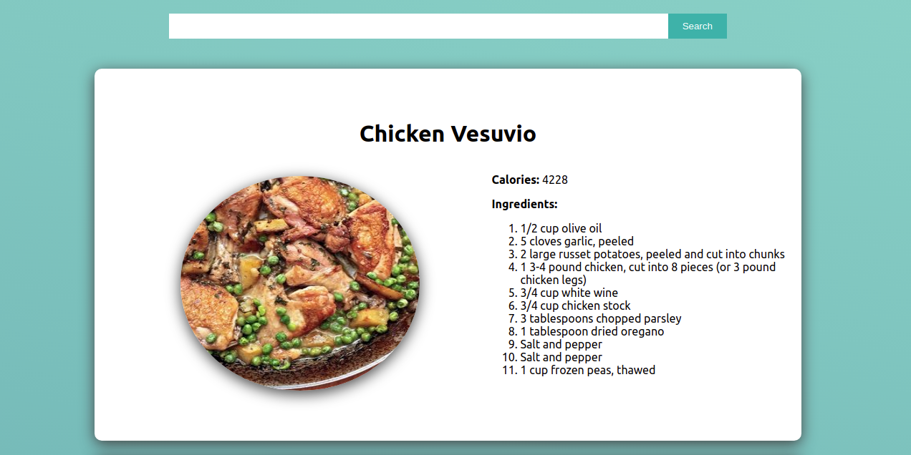

# Delicious Recipes - Recipe App

This project is about building a recipe web-page with React.
It was created with [Create-React-App](https://github.com/facebook/create-react-app)

## Screenshot



## Live version

Soon...

## Get started

```bash
   git clone git@github.com:Mesi21/Recipe_app.git
   cd into the folder by typing: cd recipe_app
   Run npm install
   Run npm start
```

 :heavy_plus_sign: add your contribution if you'd like
 and please feel free to make a PR

## Technology

- React
- Create-React-App
- npm
- Nodejs
- HTML && CSS

## Contributor:

Molnar Emese:

  - [Github](https://github.com/Mesi21)  
  - [Email:](mailto:mse212002@gmail.com) - mse212002@gmail.com
  - [Portfolio]()
  - [LinkedIn](https://www.linkedin.com/in/emesemesimolnar/).  
  - [Twitter](https://twitter.com/buksimesi21) 
  - [Angel List]()
    
## Features
- Ability to search for new recipes
- All details about the recipes are showing up on the page
  together with a picture of it

## Future Features
- Responsive design for phone and tablet sizes

## License

This project is [MIT](https://tldrlegal.com/license/mit-license) licensed.

## Show your support:

Give a :star: if you liked the app
